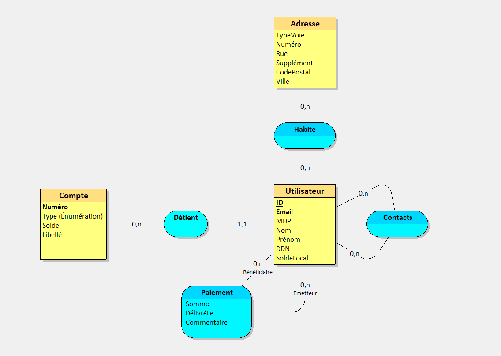

Le fichier SQL a utiliser pour les tables est paymybuddy.sql, il suppose que la base de données à été créée au préalable avant importation.
Les données ne sont pas incluses, il y a un jeu de test dans le InitController.

Exemple de script de création des variables d'environnement (nécessite peut être un redémarrage) :

```ini
set PMB_DB_URL=jdbc:mysql://localhost:3306/base_de_donnees
set PMB_DB_USERNAME=utilisateur
set PMB_DB_PASSWORD=mot_de_passe
```

Voici pour l'UML :


Le MPD (Modèle Physique de Données) :
