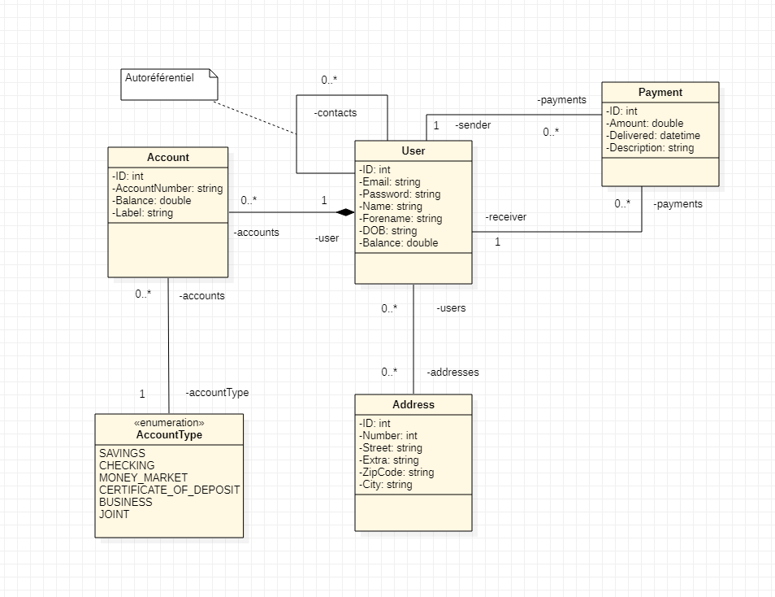

Le fichier SQL a utiliser pour les tables est paymybuddy.sql, il suppose que la base de données à été créée au préalable avant importation.
Les données ne sont pas incluses, il y a un jeu de test dans le InitController.

Voici pour l'UML :

Le MPD (Modèle Physique de Données) :
